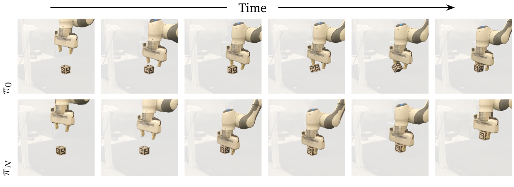

# Online Reinforcement Learning on Franka Emika Panda

This repository hosts the ROS packages, launch files, and training utilities we use to run online reinforcement-learning experiments on a real Franka Emika Panda manipulator. The goal is to make it straightforward to reproduce the hardware setup, bring up the robot, and iterate on policies either directly on hardware or in simulation.

## Repository Highlights
- `fep_rl_experiment`: ROS1 (Noetic) package for robot bring-up, cube detection, experiment logging, and the online learning node.
- `scripts/remote_training.bash`: helper script that creates an SSH reverse tunnel and launches online learning with a custom session identifier. Run this script on the workstation that has direct network access to the robot controller.
- `docker/`: Dockerfiles and compose configuration for fully reproducible runtime environments with ROS Noetic/Humble and Intel RealSense support.
- `setup/`: step-by-step hardware and software guides for preparing a lab workstation without containers.
- `external/safe-learning`: Git submodule with the Brax/JAX training stack (policy optimisation and safety-critical RL).

## Before You Start
1. Clone the repository: `git clone git@github.com:yardenas/panda-rl-kit.git; cd panda-rl-kit`
2. Review the hardware checklist in `setup/README.hardware.md`.
3. Prepare your Ubuntu 20.04 workstation following `setup/README.software.md` **or** use the Docker workflow below.
4. Verify that your Franka Emika Panda has an active FCI license and that you can ping the robot control cabinet from your workstation.

## GPU Requirements

The CUDA-enabled training stack (`safe_learning`) requires an NVIDIA GPU with compatible driver. The Dockerfile uses CUDA 12.2 by default, which is compatible with most modern setups.

### Minimum Requirements

- NVIDIA GPU (Compute Capability 7.0+)
- NVIDIA driver 535.x or newer (check with `nvidia-smi`)
- Docker with NVIDIA Container Toolkit

### CUDA Version Compatibility

The Dockerfile base image can be adjusted based on your driver version:

| NVIDIA Driver | Compatible CUDA | Dockerfile Base Image |
|---------------|-----------------|----------------------|
| 535.x - 545.x | CUDA 12.2 | `nvidia/cuda:12.2.2-cudnn8-devel-ubuntu22.04` (default) |
| 545.x - 550.x | CUDA 12.3 | `nvidia/cuda:12.3.2-cudnn8-devel-ubuntu22.04` |
| 550.x+ | CUDA 12.4 | `nvidia/cuda:12.4.1-cudnn-devel-ubuntu22.04` |
| 555.x+ | CUDA 12.5 | `nvidia/cuda:12.5.1-cudnn-devel-ubuntu22.04` |

**Check your driver:**
```bash
nvidia-smi --query-gpu=driver_version --format=csv,noheader
```

If you get CUDA compatibility errors when starting the container, update the `FROM` line in `docker/Dockerfile.safe_learning` to match your driver version, then rebuild:
```bash
docker compose -f docker/docker-compose.yaml build safe_learning
```

These GPU requirements are needed only for policy training; the robot host does not require an NVIDIA GPU.

## Docker Workflow

The Docker environment mirrors the system dependencies described in the manual setup guides while isolating ROS and Python packages.

### ROS1
1. Make sure the `safe-learning` submodule is available (only needed the first time or after cleaning the checkout):
   ```bash
   git submodule update --init --recursive
   ```
2. Build the image (run from the repository root):
   ```bash
   docker compose -f docker/docker-compose.yaml build fep_rl
   ```
3. Launch the container:
   ```bash
   docker compose -f docker/docker-compose.yaml run --rm fep_rl bash

   # Or start in detached mode
   docker compose -f docker/docker-compose.yaml up -d fep_rl

   # Then connect to running container
   docker exec -it $(docker ps -qf "ancestor=fep_rl") bash
   ```
4. Inside the container, the workspace at `/catkin_ws` is already built during the image build. Activate it with:
   ```bash
   source /catkin_ws/devel/setup.bash
   ```

> [!TIP]
> **Ports:** The default compose file maps UDP ranges `20210-20230` and `33300-33400` for robot comms. Adjust these if they conflict with services already running on your host.

## Safe-Learning Trainer

The Brax/JAX trainer lives in the `external/safe-learning` submodule. Pull it with:

```bash
git submodule update --init --recursive
```

The docker compose file now exposes two services:

- `fep_rl`: robot-side ROS1 (Noetic) sampling stack.
- `safe_learning`: CUDA-enabled training environment. It installs dependencies from the submodule so it can evolve independently of ROS packages.

Build all images after checking out the submodule:

```bash
docker compose -f docker/docker-compose.yaml build
```

To run the trainer on the same machine, launch both services and point `train_brax.py` at the exposed transition server endpoint (`tcp://host.docker.internal:5559`). When offloading training to a remote GPU machine, use `./scripts/remote_training.bash` to open a reverse tunnel (`remote:5555 -> local:5559`) and connect the trainer via `tcp://localhost:5555`. Run this helper on the workstation that talks to the robot so the tunnel originates from the host that can reach the transition server. The training service can be started with:

```bash
# Start the training container
docker compose -f docker/docker-compose.yaml up -d safe_learning

# Connect to it
docker exec -it $(docker ps -qf "ancestor=safe_learning") bash
```

<details>
<summary><strong>Remote Trainer via Reverse SSH</strong></summary>

When the robot and GPU trainer live on different networks you need a reverse SSH tunnel so the remote machine can reach the transition server that runs next to the robot.

1. **Pick tunnel details:** choose an open port on the remote GPU host (default `5555`) and make sure inbound connections to that port are allowed by its firewall.
2. **Start the tunnel from the robot workstation:**
   ```bash
   ./scripts/remote_training.bash <gpu_user> <gpu_host> [session_id]
   ```
   The helper runs `ssh -R 5555:localhost:5559 <gpu_user>@<gpu_host>` in the background, launches `bringup_real.launch`, and cleans up the tunnel when you press `Ctrl+C`. Override the port by editing the script or by running the raw SSH command yourself.
3. **Manually launching (optional):** if you prefer to manage the ROS bring-up separately, first create the tunnel:
   ```bash
   ssh -R <remote_port>:localhost:5559 <gpu_user>@<gpu_host> -N
   ```
   Then, in another terminal on the robot workstation, start `roslaunch fep_rl_experiment bringup_real.launch`.
4. **Run the trainer on the remote GPU:** point your training job at `tcp://localhost:<remote_port>`; for example:
   ```bash
   docker compose -f docker/docker-compose.yaml run --rm safe_learning \
     python train_brax.py --transition-endpoint tcp://localhost:5555
   ```

Keep the SSH session open while training.

</details>

For in-depth guidance, see `setup/README.safe_learning.md`.

### Environment Configuration

**Weights & Biases API Key:**

The training stack uses Weights & Biases for experiment tracking. Set your API key on the host machine before starting the container:

```bash
# On your host machine (not inside the container)
export WANDB_API_KEY=your_api_key_here

# Then start the container (the API key will be passed through)
docker compose -f docker/docker-compose.yaml up -d safe_learning
```

For persistence, add it to your shell profile:

```bash
# Add to ~/.bashrc or ~/.zshrc
echo 'export WANDB_API_KEY=your_api_key_here' >> ~/.bashrc
source ~/.bashrc
```

To find your API key, visit https://wandb.ai/authorize

The docker-compose configuration automatically passes the `WANDB_API_KEY` from your host environment into the container.

### Pretraining a Prior Policy

1. **Train the prior in simulation:** on the training machine run:
   ```bash
   python train_brax.py +experiment=franka_sim_to_real
   ```
   The job logs to Weights & Biases; when it finishes, open the run in the W&B UI and copy the Run ID (the short hash shown under the run name, or the final path element of the run URL).
2. **Record the W&B run id:** the `franka_sim_to_real` job uploads its replay buffer to W&B.
   You'll reuse this identifier when launching online training.

## Running Experiments

With your workspace sourced (`source devel/setup.bash`), you can start the main launch files:

- **Simulation:** `roslaunch fep_rl_experiment bringup_sim.launch`
- **Real robot (default IP 172.16.1.11):**
  ```bash
  roslaunch fep_rl_experiment bringup_real.launch \
    robot_ip:=172.16.1.11 \
    sessionId:=session_0 \
    markerSize:=0.042 \
    cubeSize:=0.05
  ```
- **Training helper script:** `./scripts/remote_training.bash <username> <host> [session_id]`
- **Online training with the pretrained prior:** run from the training machine, using the W&B ids from pretraining:
  ```bash
  python train_brax.py +experiment=franka_online \
    training.wandb_id=<wandb_run_id> \
    agent.replay_buffer.wandb_ids='[<wandb_run_id>]'
  ```
  Replace `<wandb_run_id>` with the Run ID from the simulation job (for example `username/project/abc123`). The online run resumes logging to the existing W&B project while seeding the policy and replay buffer with the simulated prior.

Experiment metrics are logged under `experiment_sessions/` and reward telemetry is published on `/instant_reward` and `/episode_reward`.

## Troubleshooting

### GPU Memory Issues

If you encounter CUDA out-of-memory errors during training, try setting these environment variables before running:

```bash
# Inside the safe_learning container
export XLA_FLAGS=--xla_gpu_triton_gemm_any=true
export MADRONA_DISABLE_CUDA_HEAP_SIZE=1

# Then run training
uv run python train_brax.py +experiment=franka_sim_to_real
```

These flags help reduce memory usage:
- `XLA_FLAGS`: Enables Triton GEMM kernels which can be more memory-efficient
- `MADRONA_DISABLE_CUDA_HEAP_SIZE`: Disables pre-allocation of large CUDA heap in Madrona simulator

### W&B Authentication

If training fails with authentication errors, ensure your W&B API key is set (see Environment Configuration above).

## Manual Installation

If you prefer to work natively, follow the detailed instructions in `setup/README.software.md`. They cover ROS Noetic installation, RealSense kernel modules, Python dependencies, catkin workspace creation, and sanity checks for both simulation and real hardware bring-up.

That document also lists the Python packages that mirror the Docker image.

## Project Layout

- `fep_rl_experiment/launch`: ROS launch files for simulation, real-robot operation, and cube detection.
- `fep_rl_experiment/nodes`: Python entry points for the robot interface, dummy publishers, and online learning orchestration.
- `fep_rl_experiment/src/fep_rl_experiment`: Core environment, robot abstractions, logging utilities, and the ONNX-based transition server.
- `setup/`: Documentation for hardware and software preparation.
- `docker/`: Container recipes for reproducible builds.

## Citing
Consider referring to this work in your publication by citing it using the `CITATION.cff` file.


## License

This project is released under the MIT License; see `LICENSE` for details.
