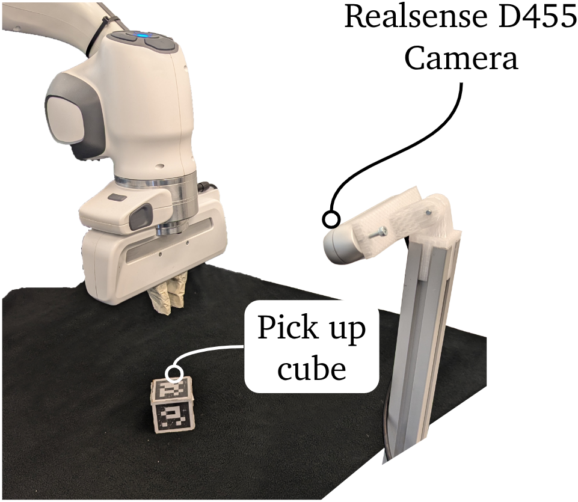

# Hardware Setup

This guide documents the physical setup that was used to collect data and run the reinforcement-learning experiments showcased in this repository. Following these steps will get your Franka Emika Panda workspace ready for the software stack described in `setup/README.software.md`.



## Bill of Materials

- Franka Emika Panda 7-DoF arm with a valid FCI (Franka Control Interface) license and control cabinet.
- External control workstation (tested with Ubuntu 20.04) with at least 4 CPU cores, 16 GB RAM, and a dedicated NVIDIA GPU if you plan to train policies locally.
- Intel RealSense D455 depth camera (this is the production setup) with USB 3.0 cable and a rigid mount looking at the manipulation workspace.
- Printed AprilTag or ArUco marker board. The default launch files expect single ArUco markers with IDs `571 581 591 601 611 621` at 42 mm edge length.
- Cubic grasp target (50 mm edge length) with matte surface finish for reliable pose estimation.
- Matte black cloth or backdrop to cover the table surface and improve visual contrast for cube detection.
- Stable workbench that can anchor the Panda base and safely accommodate the camera and marker target.
- Physical E-stop button within reach of the operator and clear line of sight to the robot.

Note: The RealSense D435 has not been validated in this setup. If you choose to experiment with it, set the Safe-Learning pretraining camera `fovy` to `42` degrees in `external/safe-learning/ss2r/benchmark_suites/mujoco_playground/pick_cartesian/assets/xmls/mjx_single_cube_camera.xml` so the simulated optics match the hardware. Keep the rest of the camera pose aligned with your calibration.

## Installation and Wiring

1. **Mount the robot base** on the workbench following Franka Emika’s official mechanical instructions.
2. **Connect power and emergency-stop loop** according to the Panda user manual. Verify that the control cabinet boots correctly and that the E-stop triggers as expected.
3. **Network topology:** connect the external control workstation directly to the Panda control cabinet via Ethernet. The default ROS launch files assume the cabinet uses IP `172.16.1.11`; set a static IP for the workstation on the same subnet (e.g. `172.16.1.2/24`) and confirm connectivity with `ping 172.16.1.11`.
4. **RealSense camera:** mount the camera rigidly to a tripod or frame so it observes the workspace from above at roughly a 45° angle. Secure the USB 3.0 cable to avoid tugging on the device during robot motion.

## Geometric Calibration

The launch files ship with a static transform from the Panda base frame (`panda_link0`) to the camera frame (`camera_link`). Once your hardware is installed:

1. Launch only the camera and the static transform publisher:
   ```bash
   roslaunch fep_rl_experiment bringup_real.launch robot_ip:=<your_robot_ip> sessionId:=calib_test
   ```
2. Inspect the transform in RViz. Overlay the RGB image and depth point cloud to confirm they roughly agree; that shold suffice since we later run RL to adapt to these small errors. 
3. If the camera pose differs significantly from the default (~0.9 m above and slightly offset from the base), update both of the following:
   - **ROS bring-up:** edit the `args` of the `static_transform_publisher` in `fep_rl_experiment/launch/bringup_real.launch`. The first three numbers are the XYZ translation in metres; the next four numbers are the quaternion (x, y, z, w). Restart the launch file after any change.
   - **Safe-Learning simulator:** edit the `<camera>` entry in `external/safe-learning/ss2r/benchmark_suites/mujoco_playground/pick_cartesian/assets/xmls/mjx_single_cube_camera.xml`. Set the `pos="x y z"` attribute to match your measured translation and adjust the `euler` angles (in radians) so the simulated camera view matches the real one. Keeping both files in sync ensures that the rendered observations used for policy training align with the real camera viewpoint. See [Mujoco Viewer](https://mujoco.readthedocs.io/en/stable/python.html#interactive-viewer) to inspect the camera configuration.
4. Update the ArUco marker size (`markerSize`) and cube size (`cubeSize`) arguments if you use different targets.

## Operational Safety Checklist

- Keep the Panda’s workspace clear and familiarize yourself with the arm’s collision and joint limits before running experiments.
- Verify that the robot is in gravity-compensation mode and that the brakes disengage cleanly before enabling autonomous control.
- Always start experiments at low speed and monitor the `instant_reward` and `episode_reward` topics to ensure the policy behaves as expected.
- Maintain a clear path to the E-stop and be ready to disable power at the control cabinet if the robot moves unexpectedly.

Proceed to `setup/README.software.md` once the physical installation is complete.
